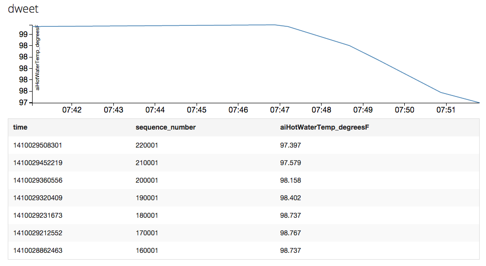

# InfluxDB - dweet.io data ingest

This is an experiment to ingest data from [dweet.io](http://dweet.io) into 
[InfluxDB](http://influxdb.com/download/).

## Dependencies

I assume that you've InfluxDB installed and also its
[Python client lib](http://influxdb.com/docs/v0.8/client_libraries/python.html).
Further, a database in InfluxDB with the name `dweet` must exist along with
the following user (with Admin role enabled):

    user name: dweet
    password:  dweet

Also, make sure the time series `dweet` is empty, by executing the following in
the Web UI:

    delete from dweet
or

    drop dweet

## Usage

Simply run the script, providing it the FQHN where your InfluxDB runs, like this:

    python dwingest.py influxdb
    
You should then see the something like this in the 
[InfluxDB UI](http://influxdb:8083/) when executing 
`select  aiHotWaterTemp_degreesF from dweet`:

## License

See the [LICENSE](LICENSE) file.
