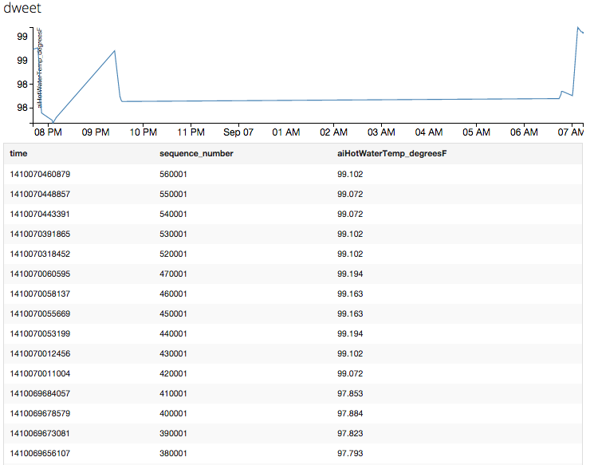

# InfluxDB - dweet.io data ingest

This is an experiment to ingest data from [dweet.io](http://dweet.io) into 
[InfluxDB](http://influxdb.com/docs/v0.8/introduction/overview.html).

## Dependencies

I assume that you've [installed](http://influxdb.com/download/) InfluxDB,
as well as its
[Python client lib](http://influxdb.com/docs/v0.8/client_libraries/python.html).
Further, you'll need to create a database in InfluxDB with the name 
`dweet` along with the following user (with Admin role enabled):

    user name: dweet
    password:  dweet

Also, make sure the time series `dweet` is empty, by executing the following in
the Web UI:

    delete from dweet
or

    drop dweet

## Usage

Simply run the script, providing it:

* the FQHN where your InfluxDB runs
* the thing itself, [discover](https://dweet.io/see) it first
* the key that you want to track (an item of the `content` object)

For example, call the script like this:

    python dwingest.py influxdb AvocadoGrove aiHotWaterTemp_degreesF
    
which pulls data from the thing [AvocadoGrove](https://dweet.io:443/get/latest/dweet/for/AvocadoGrove)
using the key `aiHotWaterTemp_degreesF`:

      {
          "by": "getting",
          "the": "dweets",
          "this": "succeeded",
          "with": [
              {
                  "content": {
                      "aiHotWaterTemp_degreesF": 98.463,
                      "aiOutsideTemp_degreesF": 95.935,
                      ...
                  },
                  "created": "2014-09-06T16:56:32.305Z",
                  "thing": "AvocadoGrove"
              }
          ]
      }

You should then see something like this in the [InfluxDB UI](http://influxdb:8083/): 

when executing: 

    select aiHotWaterTemp_degreesF from dweet

## License

See the [LICENSE](LICENSE) file.
